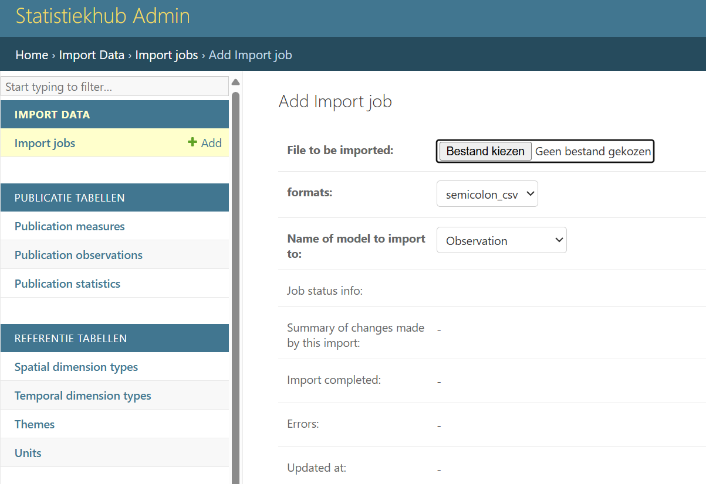

# Cijfers toevoegen aan de statistiekhub {#sec-cijfers}

## Import Jobs

Nieuwe cijfers (`observations`) (voor BBGA of voor andere publicatietabellen) voegen we toe of wijzigen we via de beheerwebsite van de statistiekhub. Je kan alleen cijfers toevoegen van indicatoren die zijn toegekend zijn aan jouw `team`.

Plaats het definitieve csv-bestand in de map `Statistiekhub\data_verwerking\04 0 data voor export`, zodat we alle gegevens ook centraal hebben staan. 
Zorg dat het bestand voldoet aan de volgende naamgeving: `<datum>_<team>_cijfers.csv`, bijvoorbeeld:
  
`20230208_veiligheid_cijfers.csv`  
  
Ga vervolgens naar de beheerwebsite voor het toevoegen of wijzigen van nieuwe cijfers  
`http://statistiekhub.amsterdam.nl/import_export_job/importjob/`  

 

Nadat je bent ingelogd op de beheerwebsite, kan je via de knop `import` het csv-bestand importeren. 
  
- Bij `format` kan je kiezen tussen `csv` of `semicolon csv`.  
- Bij `Name of model to import` geef je `observation` aan.  
  
Voordat de cijfers gepubliceerd worden, moeten alle metadata van de indicatoren met de juiste `temporal_type`, de juiste ruimtelijke indelingen en juiste `units` (aantal, percentage, km2 etc.) in de Statistiekhub aanwezig zijn. Hierop wordt gecontroleerd bij de import. In de metadata is aangeven of de data over een `periode` gaat dan wel `peildatum` betreft. Hier wordt ook op gecontroleerd bij het invoeren van de cijfers.  
  
De geleverde cijfers moeten de volgende zeven kolommen bevatten en is opgebouwd volgens het principe van een `long format`: d.w.z dat de dataset slechts één kolom met numerieke waardes bevat. 

::: {style="font-size: 0.8em;"}
    
| kolomnaam     | toelichting                              |notitiewijze |
|---------------|------------------------------------------|-------------|
| spatial_code  | code van de ruimtelijke dimensie         | AA01        | 
| spatial_type  | type ruimtelijke dimensie                | Buurt       |
| spatial_date  | datum van de ruimtelijke dimensie        | 20220324    |
| temporal_date | peildatum of startdatum (bij periode)    | 20250101    |
| temporal_type | peildatum of periode                     | peildatum   |
| measure       | naam van de indicator                    | vest_p      |
| value         | (niet afgeronde) waarde van de indicator | 3.754297    |

: Tabel 1 Opbouw databestand voor de Statistiekhub

:::

## ruimtelijke dimensie

Op basis van de items `spatial_code`, `spatial_type` en `spatial_date` is het mogelijk om een unieke ruimtelijke dimensie te realiseren. Spatial_date (de datum van de gebiedsindeling) is hierbij nodig omdat er soms (grens)wijzigingen en ruimtelijke herindelingen plaatsvinden. De laatste belangrijke gebiedswijziging voor Amsterdam vond plaats op 24 maart 2022, toen Weesp en Amsterdam werden samengevoegd tot een gemeente. De kans is groot dat je de gebiedsindeling gebruikt op basis van deze laatste wijziging. De spatial_date is in dit geval `20220324`.  ALs je opnieuw historische data aanlevert zal dat in het algemeen ook via de nieuwe gebiedsindeling zijn.  
    
`Spatial_type` heeft betrekking op het type gebied. De meest gangbare indeling waar onderzoekers statistieken op berekenen zijn:  
   
-   Bedrijventerrein\
-   Winkelgebied\
-   Buurt\
-   Wijk\
-   GGW-gebied\
-   Stadsdeel\
-   Gemeente
  
Het kan voorkomen dat er cijfers gemaakt worden van onbekende gebieden of restgebieden terwijl het gebied onbekend is. 
it komt bijvoorbeeld voor bij verkeerd ingevulde postcodes op enquetes, of als het gebied niet bestaat in een specifieke ruimtelijke indeling, maar wel waardes bevat.
Dit geldt bijvoorbeeld voor Westpoort dat geen GGW-gebied is. 
Voor deze situaties is er per ruimtelijke dimensie een 'restcode' bedacht die gebruikt kan worden om de populatie van alle cijfers sluitend te krijgen. 
  
De volgende rest `spatial_codes` zijn toegestaan bij spatial_type `20220324`:  
  
-  bij Stadsdeel: Z  
-  bij GGW-gebied: ZX99  
-  bij Wijk: ZZ  
-  bij Buurt: ZZ99  
  
## temporele dimensie
  
Op basis van de `temporal_date` en `temporal_type` is het mogelijk een unieke tijdseenheid te realiseren. 
Als de indicator een waarde op een bepaald moment laat zien, gebruik dan als temporal_type 'peildatum'. 

Indien de gegevens over een periode gaan vul dan de betreffende periode in. Voorbeelden van gegevens over een periode zijn bijvoorbeeld het aantal werklozen, geboortes, misdrijven en startende ondernemingen in een jaar, kwartaal of maand. Een statistiek met als `temporal_date` `20210101` en `temporal_type` `jaar` betreft dus een statistiek over het jaar 2021 (van 1 januari 2021 tot 1 januari 2022). Je vult dus de startdatum in van de periode waar je data over gaat. Zoals eerder aangegeven geef je in de metadata ook aan of de data een `periode` of `peildatum` betreft. Ook hier geldt dat wanneer de data op een andere manier wordt aangeboden dan aangegeven in de metadata dat je dan een foutmelding krijgt.